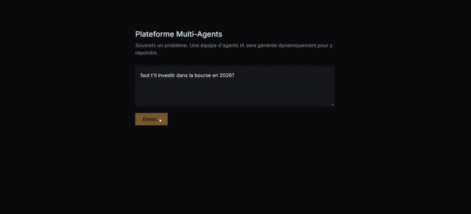

# Plateforme d'Orchestration Multi-Agents

> Soumets un problème en langage naturel. Une équipe d'agents IA est générée dynamiquement pour y répondre — avec vérification contradictoire entre agents, validation humaine conditionnelle, et un rapport final structuré. 100% gratuit, aucune carte bancaire requise.

**🔗 Démo en ligne : [plateforme-agents-black.vercel.app](https://plateforme-agents-black.vercel.app)**


<!-- Remplace par une vraie capture/GIF du graphe en action (voir section Démo ci-dessous) -->

---

## Ce qui rend ce projet différent

La plupart des projets "multi-agents" enchaînent des prompts les uns après les autres. Celui-ci fait autre chose :

- **Équipe générée dynamiquement** — le nombre et les rôles des agents dépendent du problème posé, pas d'un pipeline fixe (Planificateur + Pydantic, validation stricte du plan avant exécution)
- **Vrai parallélisme** — les agents indépendants s'exécutent réellement en simultané (tri topologique + `asyncio.gather`), pas une simulation
- **Vérification contradictoire entre agents** — un agent Critique relit tous les résultats, conteste les affirmations à faible confiance ou contradictoires, et déclenche une re-vérification bornée (budget de retry limité pour éviter l'explosion de coût)
- **Validation humaine conditionnelle** — si le Planificateur juge le sujet sensible ou coûteux, le système s'arrête et attend une approbation avant de dépenser le moindre token
- **Observabilité dès le départ** — chaque appel (recherche web, génération LLM) est loggé avec latence, tokens, et diffusé en temps réel via SSE
- **Rapport final structuré** — pas un pavé de texte : résumé, faits clés, recommandations, risques, sources

## Stack — 100% gratuit

| Composant | Service | Coût |
|---|---|---|
| Frontend | Next.js sur Vercel | 0 € |
| Backend | FastAPI sur Render | 0 € |
| Base de données | Supabase (Postgres) | 0 € |
| LLM | Groq (Qwen3.6-27B) | 0 € |
| Recherche web | Tavily | 0 € |

Aucune carte bancaire n'est nécessaire pour faire tourner ce projet de bout en bout.

## Architecture
Utilisateur → Planificateur (génère un plan dynamique, validé par Pydantic)
→ Orchestrateur DAG (agents exécutés en parallèle selon leurs dépendances)
→ Agent Critique (contestation + retry borné si finding faible/contradictoire)
→ Synthétiseur (compile tout en un rapport final structuré)
→ Frontend (graphe live via SSE + rapport + export/partage)

Détail complet dans [`architecture-plateforme-agents.md`](architecture-plateforme-agents.md).

## Limitations connues (honnêtement documentées)

Ce projet utilise exclusivement des services gratuits — ce qui implique de vrais compromis, assumés :

- **Rate limits Qwen (Groq)** : 8 000 tokens/minute sur le tier gratuit. Un run complet (4 agents + Critique + Synthétiseur) peut occasionnellement échouer partiellement à cause de ce plafond. Le système est conçu pour rester robuste dans ce cas : un rapport est produit même si un agent individuel échoue.
- **Cold start Render** : le backend gratuit se met en veille après 15 min d'inactivité ; le premier appel après une pause peut prendre 30-50 secondes.
- **Non-déterminisme du modèle gratuit** : le Planificateur génère occasionnellement un plan invalide (ex: chaîne de dépendances trop profonde) — détecté et rejeté par la validation Pydantic plutôt que de laisser passer une structure incorrecte.
- **Décommission de modèle en cours de développement** : Groq a décommissionné `llama-3.3-70b-versatile` (16 août 2026) pendant le développement de ce projet. Grâce à la couche d'abstraction LLM, la migration vers `qwen/qwen3.6-27b` n'a nécessité qu'un changement de variable d'environnement — bon test en conditions réelles de ce choix d'architecture.

## Lancer en local

**Backend**
```bash
cd backend
pip install -r requirements.txt
cp .env.example .env  # renseigne tes propres clés API (Groq, Supabase, Tavily)
uvicorn app.main:app --reload --port 8000
```

**Frontend**
```bash
cd frontend
npm install
# crée .env.local avec NEXT_PUBLIC_API_URL=http://localhost:8000
npm run dev
```

Tests backend : `pytest tests/ -v` (11 tests, couvrant Planificateur, orchestrateur, Critique, worker, Synthétiseur)

## Ce qui n'est volontairement pas dans le MVP

Outils Python/SQL, mémoire long terme/RAG, fork de workflows, galerie de templates — voir la section Risques de [`architecture-plateforme-agents.md`](architecture-plateforme-agents.md) pour le raisonnement complet.

## Auteur

Karim — [GitHub](https://github.com/karimcsss)